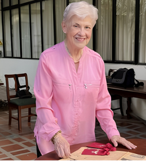

<!DOCTYPE html>
<html lang="es" class="scroll-smooth">
<head>
    <meta charset="UTF-8">
    <meta name="viewport" content="width=device-width, initial-scale=1.0">
    <title>Beatriz Briceño-Picón | Familia, Hogar y Legado</title>
    
    <!-- Favicon -->
    <link rel="icon" href="mbi.png?v=1" type="image/png">
    
    <!-- Google Fonts -->
    <link rel="preconnect" href="https://fonts.googleapis.com">
    <link rel="preconnect" href="https://fonts.gstatic.com" crossorigin>
    <link href="https://fonts.googleapis.com/css2?family=Dancing+Script:wght@700&family=Montserrat:ital,wght@0,300;0,400;0,500;0,600;0,700;1,400;1,600&display=swap" rel="stylesheet">
    
    <!-- Tailwind CSS -->
    
    
    <!-- Lucide Icons -->
    
    
    <!-- Custom Tailwind Configuration -->
    
</head>
<body class="bg-softSand text-charcoal-900 font-sans antialiased selection:bg-pine selection:text-white flex flex-col min-h-screen">

    <!-- NAVIGATION BAR -->
    <header class="fixed w-full top-0 z-50 bg-white/95 backdrop-blur-md border-b border-gray-200 transition-all duration-300">
        

            
            

                <!-- Enlace para volver a la página principal -->
                <a href="index.html" class="flex items-center text-pine hover:text-pine-light transition-colors font-bold uppercase tracking-widest text-xs">
                    <i data-lucide="arrow-left" class="w-5 h-5 mr-2"></i>
                    Volver a MBI Hoy
                </a>
            

            
            <nav class="hidden lg:flex space-x-8 text-sm tracking-widest font-semibold uppercase text-charcoal-800">
                <a href="#perfil" class="hover:text-pine transition-colors">Perfil</a>
                <a href="#legado" class="hover:text-pine transition-colors">Legado de MBI</a>
                <a href="#hogar" class="hover:text-pine transition-colors">Familia y Hogar</a>
            </nav>

            <a href="mailto:beatriz.beamer@gmail.com" class="hidden lg:inline-flex items-center text-sm uppercase font-semibold tracking-widest px-6 py-3 bg-pastelYellow text-pine hover:bg-pine hover:text-white rounded-md transition-all duration-300 shadow-sm border border-transparent hover:border-pine">Contacto</a>

            <button id="mobile-menu-btn" class="lg:hidden p-2 text-pine focus:outline-none" aria-label="Abrir Menú">
                <i data-lucide="menu" class="w-8 h-8"></i>
            </button>
        

        <!-- Menú Móvil -->
        

            <a href="index.html" class="block text-sm font-bold uppercase tracking-widest text-pine mb-4">← Volver a MBI Hoy</a>
            <a href="#perfil" class="block text-sm font-semibold uppercase tracking-widest text-charcoal-800 hover:text-pine">Perfil</a>
            <a href="#legado" class="block text-sm font-semibold uppercase tracking-widest text-charcoal-800 hover:text-pine">Legado de MBI</a>
            <a href="#hogar" class="block text-sm font-semibold uppercase tracking-widest text-charcoal-800 hover:text-pine">Familia y Hogar</a>
        

    </header>

    <!-- HERO SECTION (Elegante y cálido) -->
    <section class="relative pt-32 pb-16 lg:pt-48 lg:pb-24 bg-pine-dark text-white overflow-hidden">
        

        

            Humanista & Periodista
            <h1 class="text-4xl md:text-6xl lg:text-7xl font-bold font-title tracking-tight mb-6">
                Beatriz Briceño-Picón
            </h1>
            

                El hogar como primer bastión cívico y la custodia de un legado intelectual para las nuevas generaciones.
            

        

    </section>

    <!-- INTRO / PERFIL -->
    <section id="perfil" class="py-20 bg-white">
        

            

                

                    
                

                

                    <i data-lucide="quote" class="w-12 h-12 text-pastelYellow mb-2"></i>
                    

                        "Ha querido siempre entrelazar personas, instituciones, cátedras y empresas que trabajan por mantener la vigencia del pensamiento de su padre."
                    

                    

                        Su empeño ha sido siempre fortalecer nuestra venezolanidad desde el hogar, la escuela, el campo y los medios de comunicación social, como vía para alcanzar el humanismo integral y solidario abierto a la trascendencia que nuestro mundo reclama.
                    

                

            

        

    </section>

    <!-- ARTÍCULOS: LEGADO DE SU PADRE -->
    <section id="legado" class="py-20 bg-softSand border-t border-gray-200">
        

            

                Sobre Mario Briceño-Iragorry
                <h2 class="font-title text-3xl sm:text-4xl font-extrabold text-charcoal-900 uppercase">La Memoria de mi Padre</h2>
                

            

            

                <!-- Artículo 1 -->
                <article class="bg-white rounded-xl shadow-md hover:shadow-xl transition-shadow duration-300 overflow-hidden border border-gray-100 flex flex-col">
                    

                        
                    

                    

                        <h3 class="text-xl font-bold text-charcoal-900 mb-3">Vigencia de "Mensaje sin Destino"</h3>
                        
Una mirada personal y reflexiva sobre cómo las palabras escritas por mi padre hace décadas siguen describiendo los retos de nuestra sociedad actual.

                        <a href="#" class="text-pine font-bold uppercase tracking-widest text-xs inline-flex items-center hover:text-pastelYellow-hover transition-colors">
                            Leer Artículo <i data-lucide="arrow-right" class="w-4 h-4 ml-1"></i>
                        </a>
                    

                </article>

                <!-- Artículo 2 -->
                <article class="bg-white rounded-xl shadow-md hover:shadow-xl transition-shadow duration-300 overflow-hidden border border-gray-100 flex flex-col">
                    

                        
                    

                    

                        <h3 class="text-xl font-bold text-charcoal-900 mb-3">El hombre detrás del pensador</h3>
                        
Anécdotas cotidianas y el recuerdo de un padre que enseñaba con el ejemplo la ética y el amor profundo por Venezuela.

                        <a href="#" class="text-pine font-bold uppercase tracking-widest text-xs inline-flex items-center hover:text-pastelYellow-hover transition-colors">
                            Leer Artículo <i data-lucide="arrow-right" class="w-4 h-4 ml-1"></i>
                        </a>
                    

                </article>

                <!-- Artículo 3 -->
                <article class="bg-white rounded-xl shadow-md hover:shadow-xl transition-shadow duration-300 overflow-hidden border border-gray-100 flex flex-col">
                    

                        <i data-lucide="book-open" class="w-20 h-20 text-pine opacity-20"></i>
                    

                    

                        <h3 class="text-xl font-bold text-charcoal-900 mb-3">Defendiendo lo nuestro</h3>
                        
Un análisis sobre la importancia de conocer nuestras raíces históricas para no ceder ante la crisis moral del antipaís.

                        <a href="#" class="text-pine font-bold uppercase tracking-widest text-xs inline-flex items-center hover:text-pastelYellow-hover transition-colors">
                            Leer Artículo <i data-lucide="arrow-right" class="w-4 h-4 ml-1"></i>
                        </a>
                    

                </article>
            

        

    </section>

    <!-- ARTÍCULOS: FAMILIA Y HOGAR -->
    <section id="hogar" class="py-20 bg-white border-t border-gray-100">
        

            

                El primer bastión cívico
                <h2 class="font-title text-3xl sm:text-4xl font-extrabold text-charcoal-900 uppercase">Familia y Labores del Hogar</h2>
                

                
Reflexiones sobre el cuidado cotidiano, la crianza y la administración del hogar como cimientos fundamentales de una sociedad sana.

            

            <!-- Layout alterno para variedad visual -->
            

                
                <!-- Tema 1 -->
                

                    

                        
                    

                    

                        <h3 class="text-2xl font-bold text-charcoal-900">El arte de hacer hogar</h3>
                        
El orden, la limpieza y la dedicación a los quehaceres diarios no son tareas menores, sino actos de profundo amor que construyen el refugio seguro donde se forma el carácter de los futuros ciudadanos.

                        

                            <a href="#" class="text-pine font-bold uppercase tracking-widest text-xs inline-flex items-center border-b-2 border-transparent hover:border-pine transition-all pb-1">
                                Leer reflexión completa <i data-lucide="arrow-right" class="w-4 h-4 ml-2"></i>
                            </a>
                        

                    

                

                <!-- Tema 2 -->
                

                    

                        
                    

                    

                        <h3 class="text-2xl font-bold text-charcoal-900">Educar en valores desde la mesa</h3>
                        
La mesa familiar es la primera escuela de civismo. Es el lugar donde se aprende a escuchar, a compartir y donde se transmiten las tradiciones que nos dan identidad como pueblo.

                        

                            <a href="#" class="text-pine font-bold uppercase tracking-widest text-xs inline-flex items-center flex-row-reverse md:flex-row border-b-2 border-transparent hover:border-pine transition-all pb-1">
                                <i data-lucide="arrow-left" class="w-4 h-4 mr-2 hidden md:inline-block"></i>
                                Leer reflexión completa
                                <i data-lucide="arrow-right" class="w-4 h-4 ml-2 md:hidden"></i>
                            </a>
                        

                    

                

            

        

    </section>

    <!-- FOOTER -->
    <footer class="bg-pine-dark text-white mt-auto border-t-4 border-pastelYellow">
        

            

                <h3 class="font-title text-xl font-extrabold tracking-wider uppercase text-pastelYellow mb-2">Beatriz Briceño-Picón</h3>
                
Periodismo, Familia y Humanismo.

            

            

                <a href="mailto:beatriz.beamer@gmail.com" class="flex items-center text-sm hover:text-pastelYellow transition-colors">
                    <i data-lucide="mail" class="w-4 h-4 mr-2"></i> beatriz.beamer@gmail.com
                </a>
                <a href="index.html" class="flex items-center text-sm font-bold uppercase tracking-widest text-pine-light hover:text-white transition-colors">
                    Ir a MBI Hoy <i data-lucide="external-link" class="w-4 h-4 ml-2"></i>
                </a>
            

        

        

            
© 2026 Beatriz Briceño-Picón. Todos los derechos reservados.

        

    </footer>

    <!-- JAVASCRIPT LOGIC -->
    
</body>
</html>
